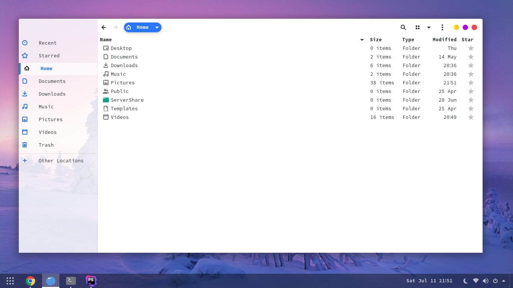

#### Instalación

- Descomprime el archivo ZIP en el directorio de temas `/usr/share/themes/`
o `~/.themes/` (crear si es necesario).

- Puedes ejecutar el tema desde la terminal con el siguiente comando

```
gsettings set org.gnome.desktop.interface gtk-theme "$theme"
gsettings set org.gnome.desktop.wm.preferences theme "$theme"
```

- Tambien puedes cambiar el tema usando `Gnome Tweaks`

#### Galeria de Temas

**_FluentBlue-Theme_**


**_WhiteSur-Theme_**


 
 #### Arte al Programar
 
 - [Facebook](https://fb.com/arteaprogramar)
 - [Instagram](https://twitter.com/arteaprogramar)
 - [Twitter](https://instagram.com/arteaprogramar)
 - [Youtube](https://www.youtube.com/channel/UCh94p1M7dg1y9f_Yik1vGjw)
