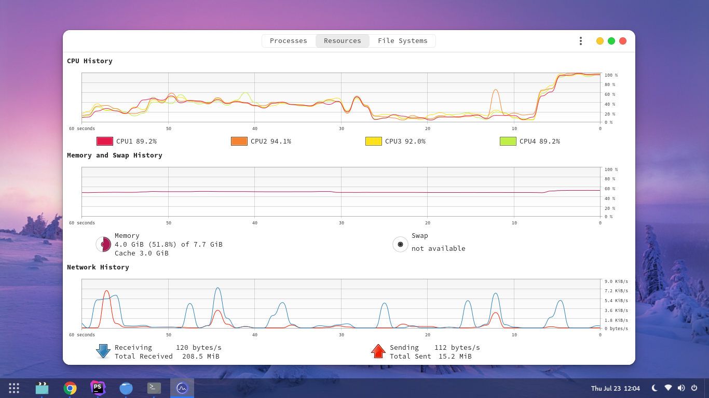

#### Instalación

- Descomprime el archivo ZIP en el directorio de temas `/usr/share/themes/`
o `~/.themes/` (crear si es necesario).

- Puedes ejecutar el tema desde la terminal con el siguiente comando

```
gsettings set org.gnome.desktop.interface gtk-theme "WhiteSur-light"
gsettings set org.gnome.desktop.wm.preferences theme "WhiteSur-light"
```

- Tambien puedes cambiar el tema usando `Gnome Tweaks`

#### Capturas de Pantalla

_Terminal_


_Nautilus_


_Monitor_



#### Contribuciones

Este tema no ha sido desarrollado por `Arte al Programar` 
el autor ha publicado su tema en [https://www.gnome-look.org/](https://www.gnome-look.org/).
 
 #### Arte al Programar
 
 - [Facebook](https://fb.com/arteaprogramar)
 - [Instagram](https://twitter.com/arteaprogramar)
 - [Twitter](https://instagram.com/arteaprogramar)
 - [Youtube](https://www.youtube.com/channel/UCh94p1M7dg1y9f_Yik1vGjw)
